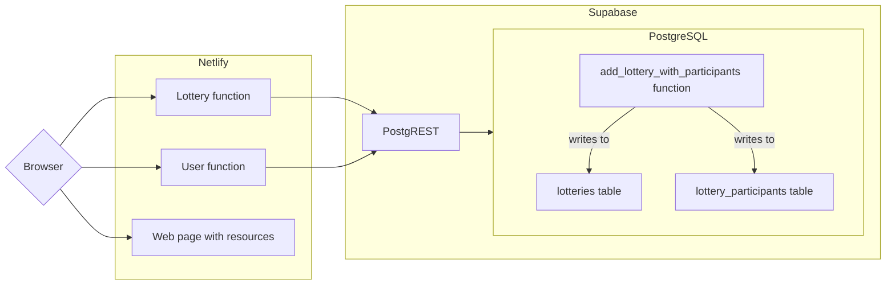

# GiftMate

GiftMate is a service that allows user to match people for Christmas gift lottery. User need to input participant of the lottery and GiftMate will assign them to each other. For every participant GiftMate will generate unique and one time use only link which will reveal who user will gift.

The service is hosted [here](https://gitftmate.netlify.app/).

## Technology

The service is a good example of integration between [Netlify](https://www.netlify.com/) and [Supabase](https://supabase.com/) as it is using:
* Static site hosting and serverless functions from Netlify
* PostgreSQL from Supabase

For analytics it uses [Piwik Pro](https://piwik.pro/).

## High level architecture

## Available API resources

| Method      | Url         | Description    | Return      |
| ----------- | ----------- | -------------- | ----------- |
| `POST`  | `/.netlify/functions/giftmate`          | Creates a new lottery. Body description is here. | Lottery unique identifier |
| `GET`   | `/.netlify/functions/lotteries/${uuid}` | Retrieves info about the lottery | Participants together with unique urls and info if they have been used |
| `GET`   | `/.netlify/functions/users/${nonce}`    | Retrieves info about the assignment for the user. One time only! | Gifter's and giftee's names |

## Repository structure

* HTML with CSS and background picture can be found in `netlify/web`
* Serverless function called from the frontend can be found in `netlify/functions`
* Database schema and functions are in `supabase/migrations`

## Working with database

In order to use described commands you need to have installed [Supabase CLI](https://supabase.com/docs/reference/cli/start), authenticate and link it to the project. All the commands need to be executed from `supabase` directory.

* `supabase migration list` shows all the local and remote migrations that have been applied
* `supabase db push` applies migrations to remote dataase
* `supabase db reset` reset all local migrations and applies them again
* `supabase migration repair <id> --status reverted ` revert migration in remote database

## Working with web hosting and serverless functions

In order to use described commands you need to have installed [Netlify CLI](https://docs.netlify.com/cli/get-started/), authenticate and link it to the project. All the commands need to be executed from `netlify` directory.

* `netlify dev` ramp up netlify functions and web hosting locally
